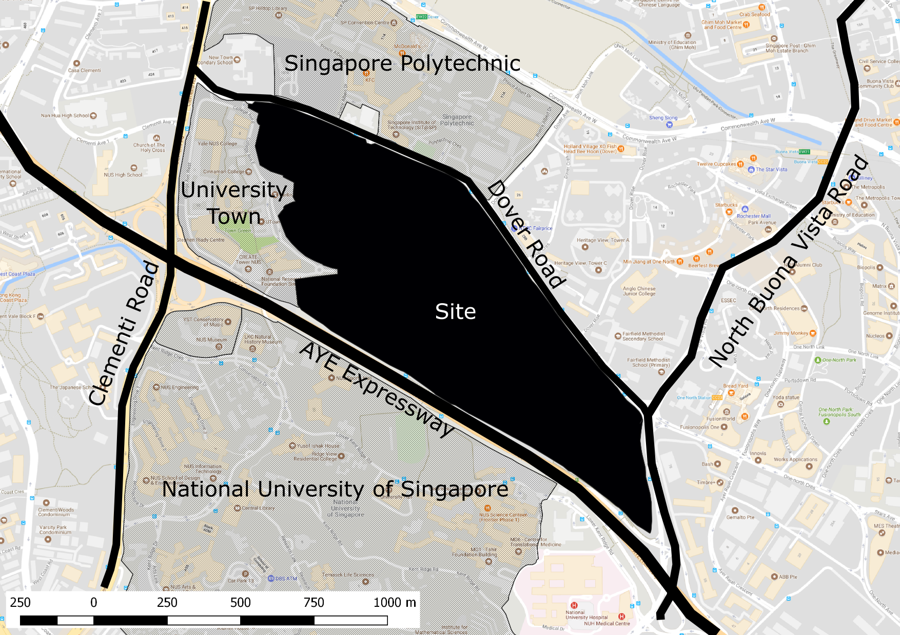

# Introduction

This book documents a simple urban design example to illustrate the use of computational design methods in an urban design process. The example is used as teaching material for the Urban Prototyping Module taught at National University of Singapore, Architecture Department. The example is located along Dover Road in Singapore. The site is about 75 Ha. The target population for this site is 75,000 residents. The brief is to design a mix-used development consisting of residential, commercial, green and open spaces. Students are required to produce a range of feasible urban design proposals to satisfy the brief. We have divided the design process into three main stages 1\) site analysis 2\) planning concept development and 3\) building typology design. From our experience in design and teaching, the design process is often non-linear, iterative and cyclical. It is more useful to see these stages as related but independent. Designers will often jump from stage to stage during design process. The simple example is used to illustrate such a design process and serves as a guide for the students through their learning. 

The Urban Prototyping Module teaches computational methods to facilitate the urban design process. In the site analysis stage, we will introduce Geographical Information System \(GIS\) technology to support the use of geospatial data. These data are often unstructured and massive. They have to be manipulated through computational means in order for designers to extract information from them. These information will then contribute to the understanding of the site and context. 

In the planning concept development and typology design stage, we will introduce the use of parametric modelling to support rapid virtual prototyping. This will require students to learn and practice computational thinking such as decomposition, abstraction and algorithm development. They will have to decompose their planning concept or building typology,  extract the essence of their design and implement them as generative algorithm in the form of parametric modelling. Students can then assess many design alternatives rapidly generated from the model. The ability to generate and assess many design alternatives can facilitate the student understanding of their own design and inform their next iteration.

