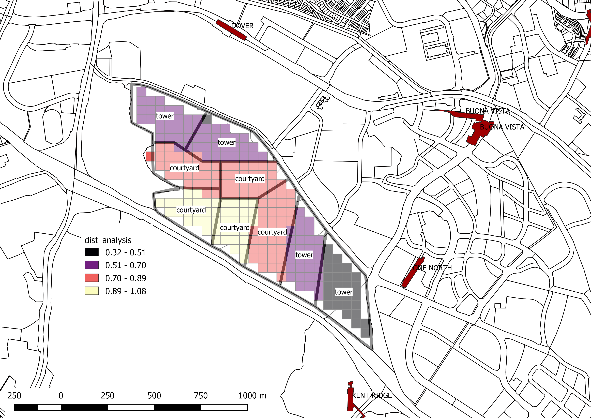
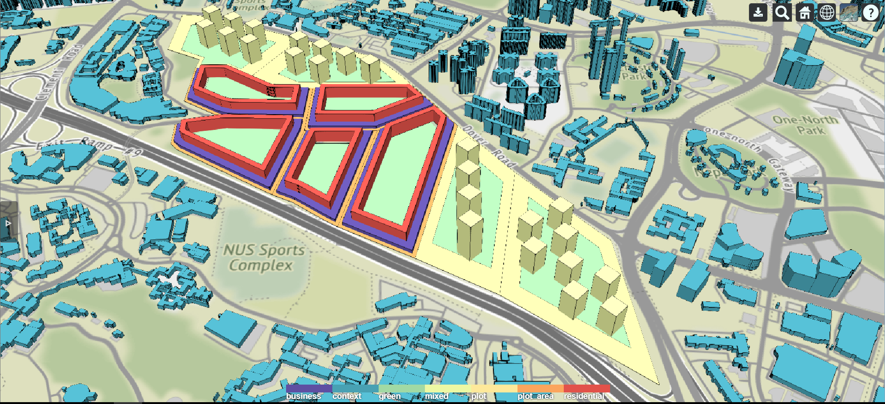
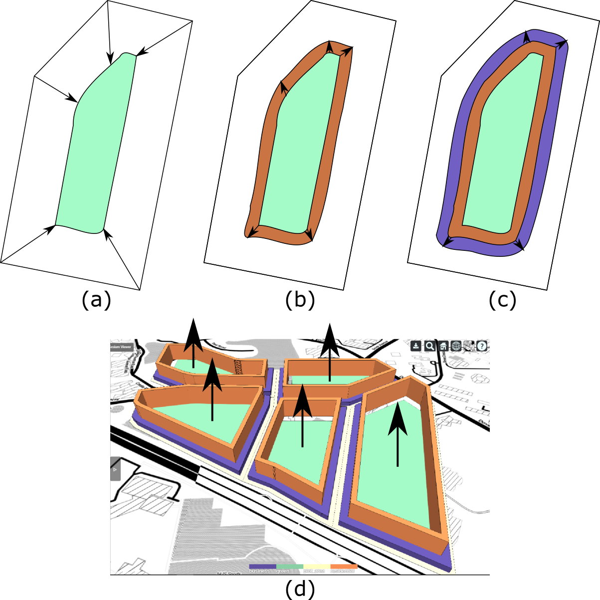
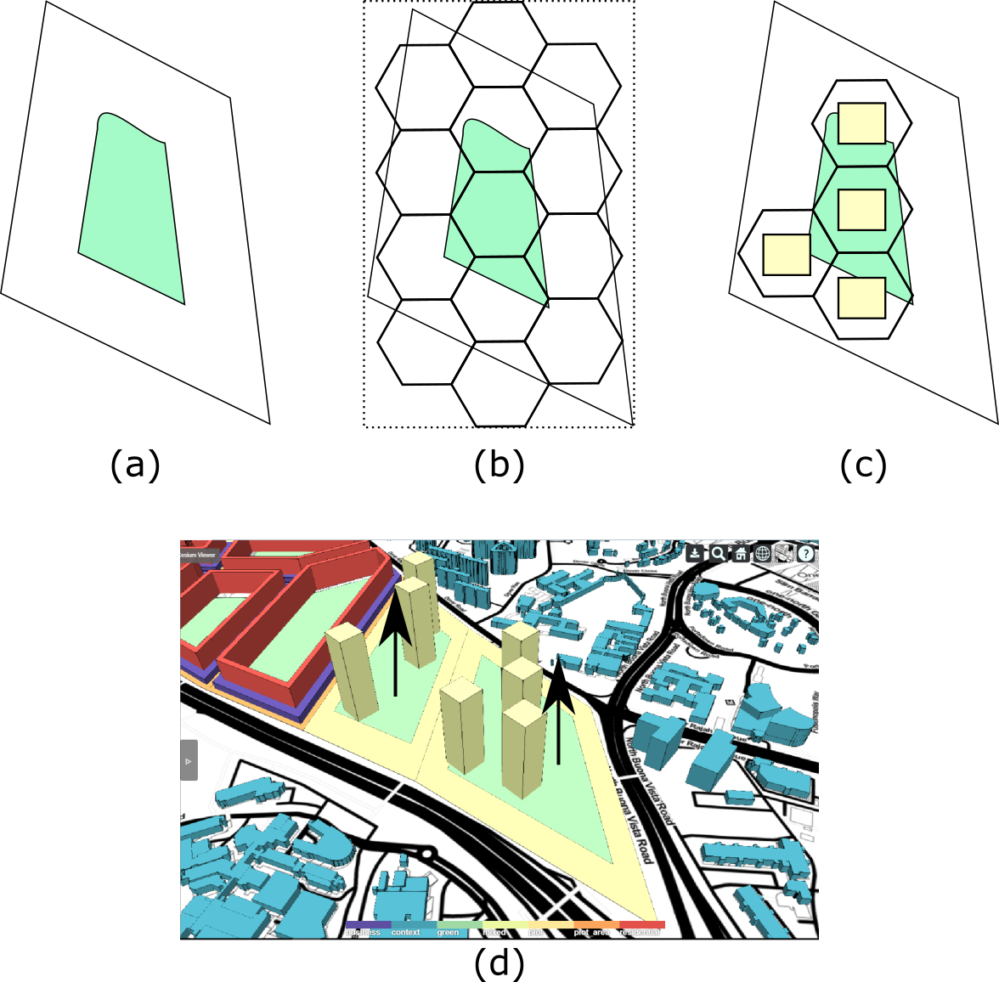
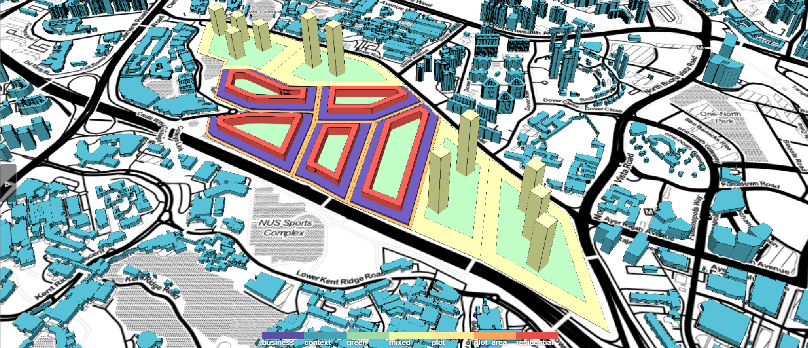
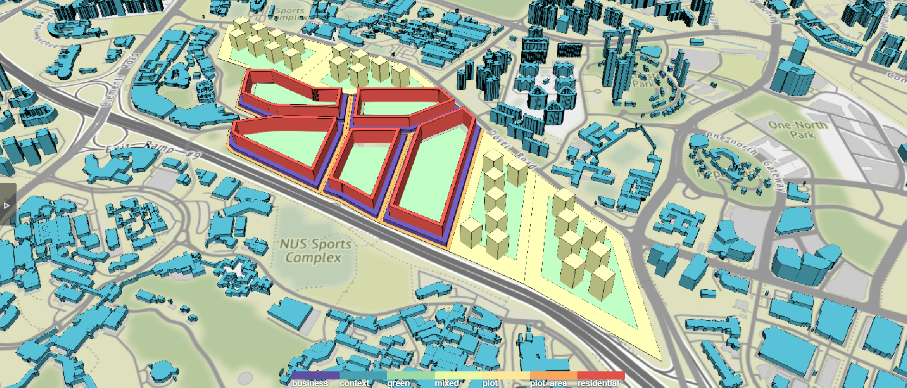

# Urban Prototyping 2018

The typology for the site is decided based on its closeness to the MRT station. The sites closer to the MRT station have tower typology, while those further away have courtyard typology \(Fig. 1\). Fig. 2 shows the typology generated based on the assignment. The typology is generated based on the requirement of accommodating 75,000 people. Based on Singapore census data, a household has 3.2 people. Thus, 75,000 people is equivalent to 23,438 households. Usually, each household will have 2 working adults. That would amount to 46,876 working people. The floor space requirement for accommodating these people are each person requires 20m2 of living area and 5m2 of green/open area. Each working person requires 10m2 of office/working space. The population is distributed based on each plot's size. The bigger the plot size, the bigger the population assigned to the plot.

The courtyard typology is generated according to these procedure:

1. Offset the plot inwards to create the inner courtyard \(Fig. 3a\). The amount of inset is based on the required green/open area for the residents living on the plot. 
2. Offset the courtyard polygon outwards to create the inner courtyard buildings \(Fig. 3b\). These are residential buildings. The amount of outset is based on the building depth specified by the designer.
3. Offset the residential polygon outwards to create the outer courtyard buildings \(Fig. 3c\). These are commercial buildings. The amount of outset is based on the building depth specified by the designer.
4. The polygons are extruded to fulfill the GFA requirement to accommodate the desired density \(Fig. 3d\). 

The tower typology is generated according to these procedure:

1. Offset the plot inwards to create the inner courtyard \(Fig. 4a\) . The amount of inset is based on the required green/open area for the residents living on the plot. 
2. A hexagon grid is created based on the plot's bounding box\(the dotted line in Fig. 4b\).
3. Hexagon grid that is not fully enclosed within the plot is removed. A square tower footprint is generated on the centroid of each hexagon grid. The size of the footprint is generated based on the building width specified by the designer \(Fig. 4c\).
4. The footprints are extruded to fulfill the GFA requirement to accommodate the desired density \(Fig. 4d\). 

The parameters controlling the generative model can be adjusted to generate different design alternatives \(Fig. 5 & 6\). 

