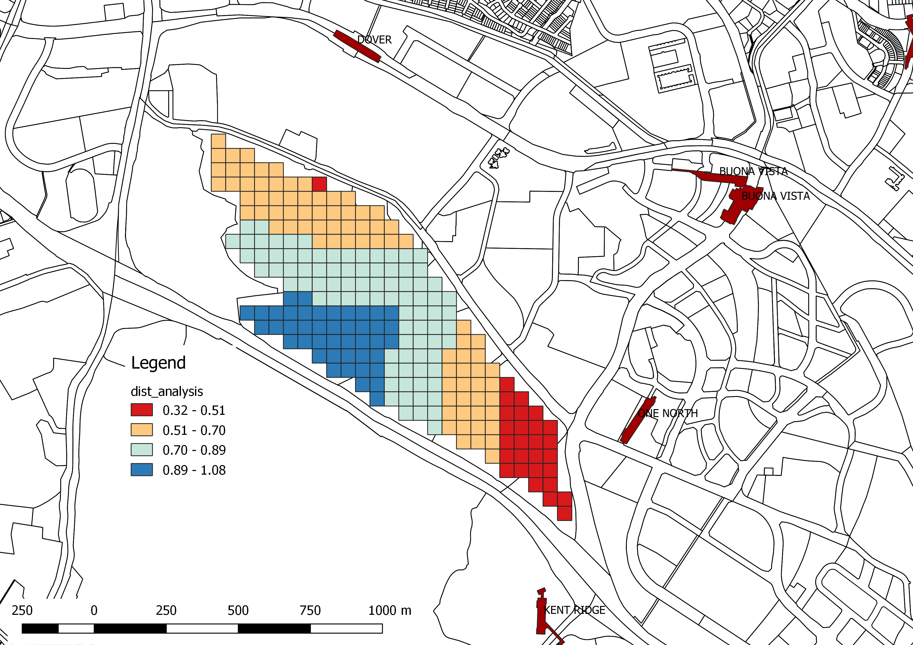
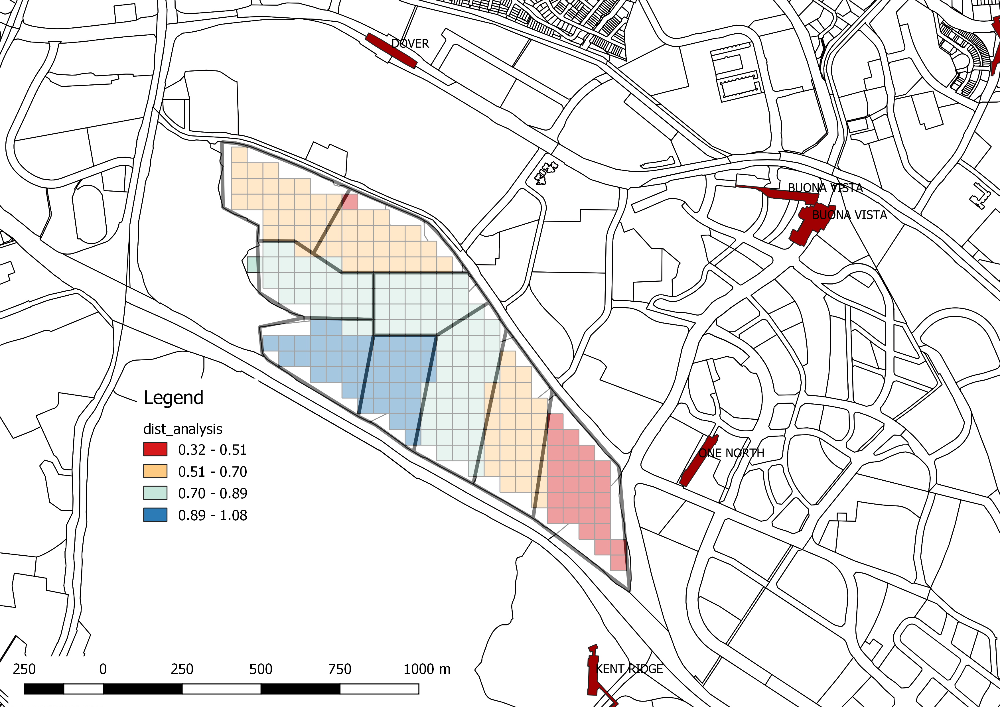

# Planning Concept Development

In this chapter, we will use the distance analysis result for developing planning concepts. Fig. 1 shows the distance analysis results categorised into 4 categories. The site is manually divided into plots based on the closeness to MRT,  \(Fig. 2\). 

