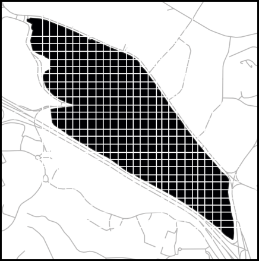
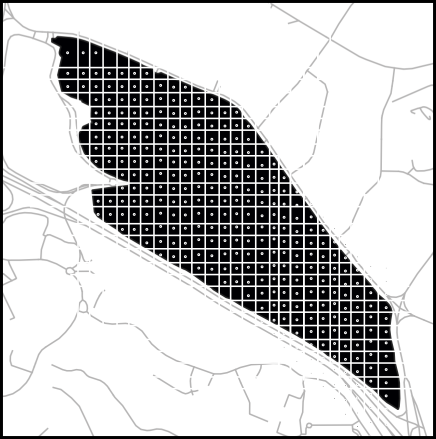
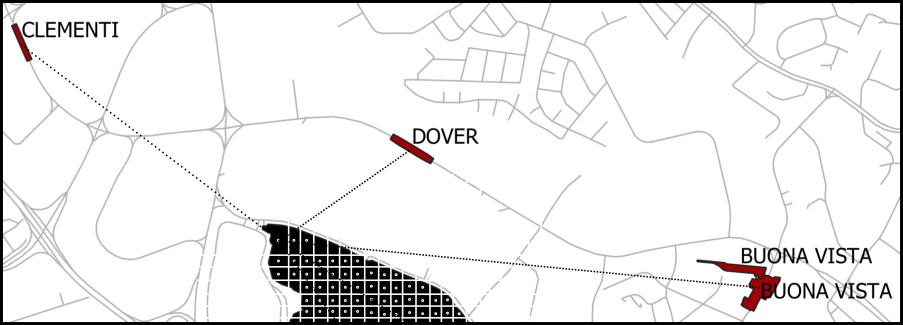

# Distance Analysis

After obtaining a basic understanding of the site, we are interested in diving deeper into analysing the closeness of the site to the surrounding MRT stations. For this analysis, we will need these data:

* The site geometry
* The location of the MRT stations

We performed a distance analysis of the site to the MRT stations as follows:

1. Divide the site into grids of 50m x 50m \(Fig. 1\).
2. Get the centroid for each grid \(Fig. 2\). 
3. For each centroid, measure the distance of the centroid to all the MRT stations.
4. Of all the measured distance, choose the shortest distance and append it onto the grid.
5. A false-colour image will be generated based on the closeness to MRT.

