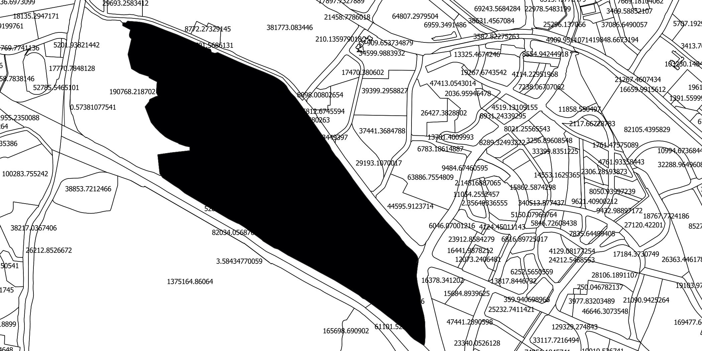
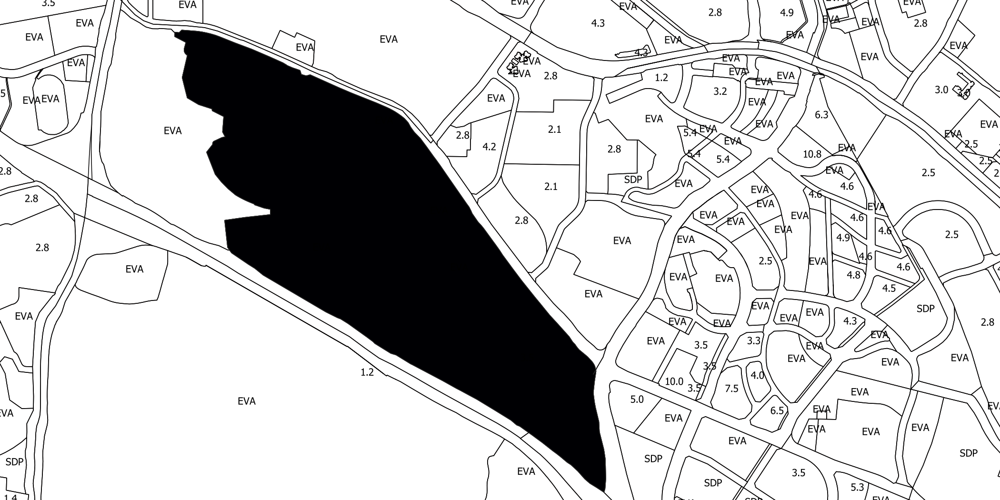
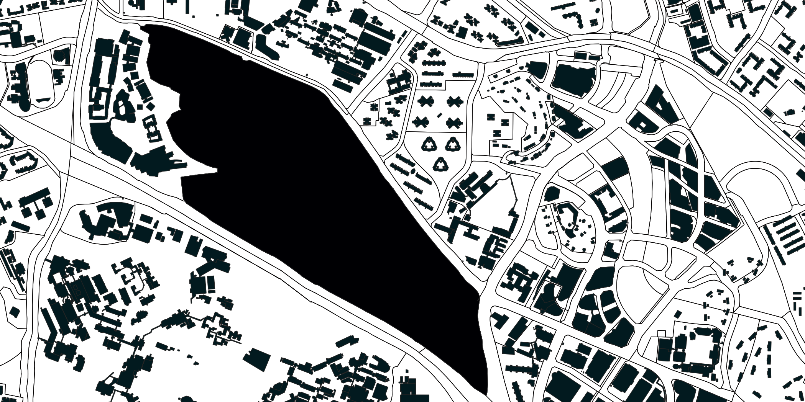
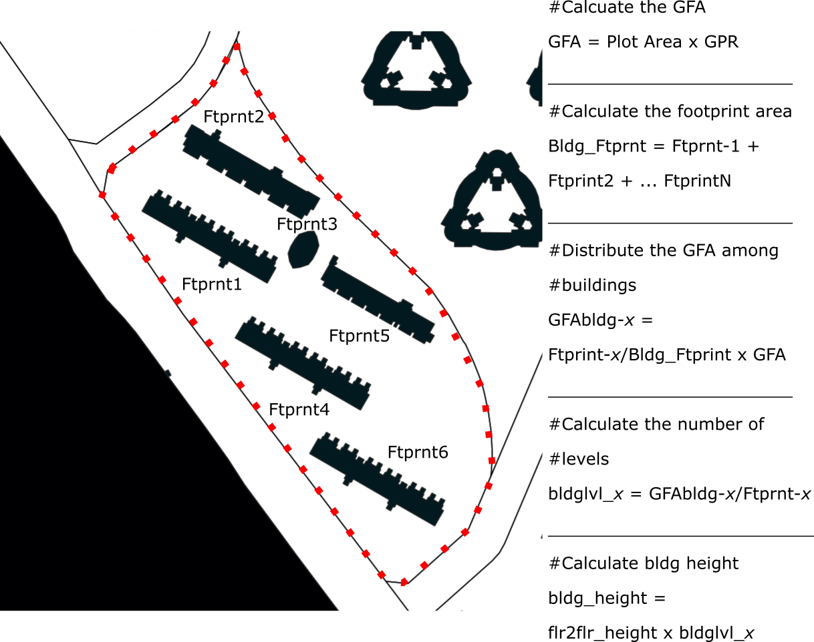

# Generating 3D City Model

It is essential to have 3D information on top of the 2D information of the site for understanding the context. As building height data is usually not openly available, we derived the building height data from two main available data:

* Gross Plot Ratio \(GPR\)
* Plot Geometry 
* Building Footprint Area
* Building Footprint Geometry

The procedure for the generation of 3D model is as follows:

1. For each plot, measure its area \(Fig. 1\). 
2. Get the maximum permissible Gross Floor Area \(GFA\) by multiplying the plot area \(Fig. 1\) by the GPR \(Fig. 2\).
3. For each plot, identify the building footprints on the plot \(Fig. 3\).
4. Calculate the area of all the building footprints. 
5. Distribute the GFA among the buildings based on their footprint area \(Fig. 4\).
6. For each building, divide the assigned GFA by their building footprint to obtain the number of levels for each building \(Fig. 4\)
7. Assuming a floor-to-floor height, calculate the building height by multiplying the levels by the floor-to-floor height \(Fig. 4\). 
8. Extrude the buildings to get the 3D model \(Fig. 5\).  

