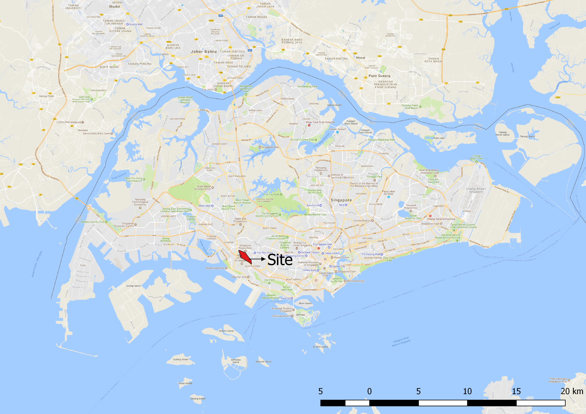
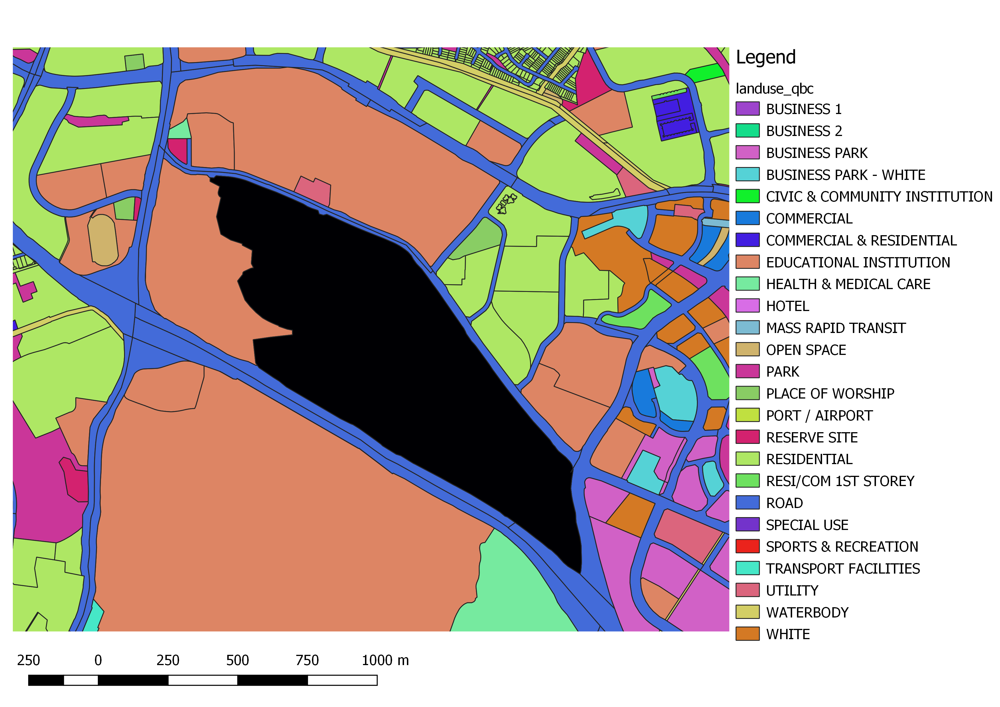
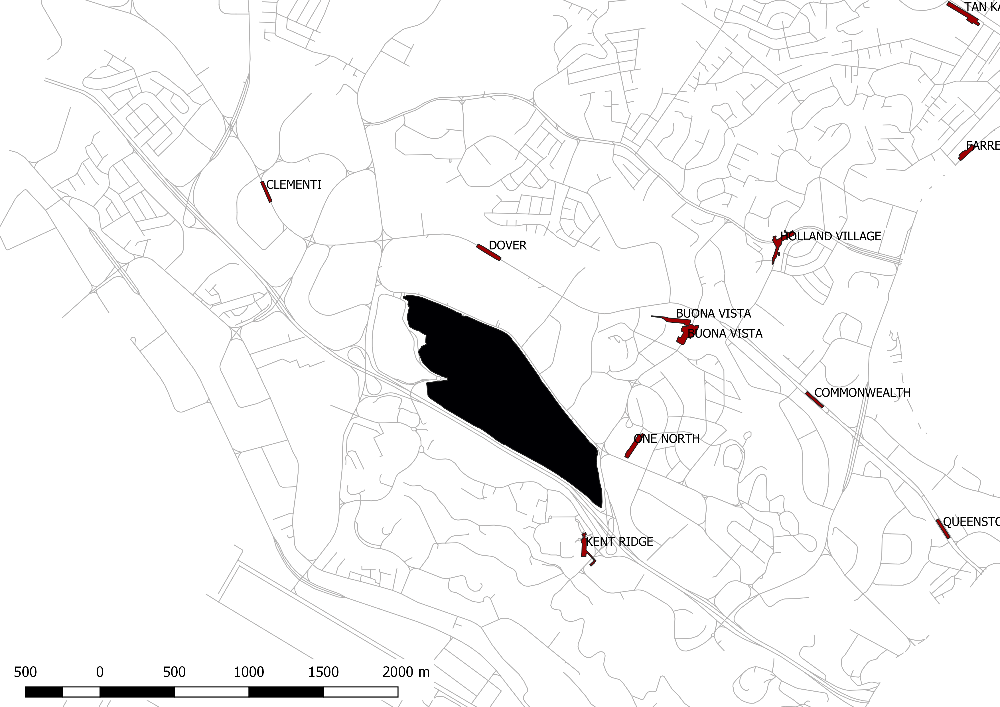

# Site Analysis 2D

With the open geospatial data obtained, we can quickly perform basic site analysis on our site. The images below are generated from using GIS software with minimal graphic manipulation \(Fig. 1-3\). As we are interested in assessing the accessibility of the site, the location of all the MRT stations around the site is obtained from the open data portal. In addition, we have also obtained the road network data from SG One Map. Fig. 4 illustrates the accessibility of the site.

